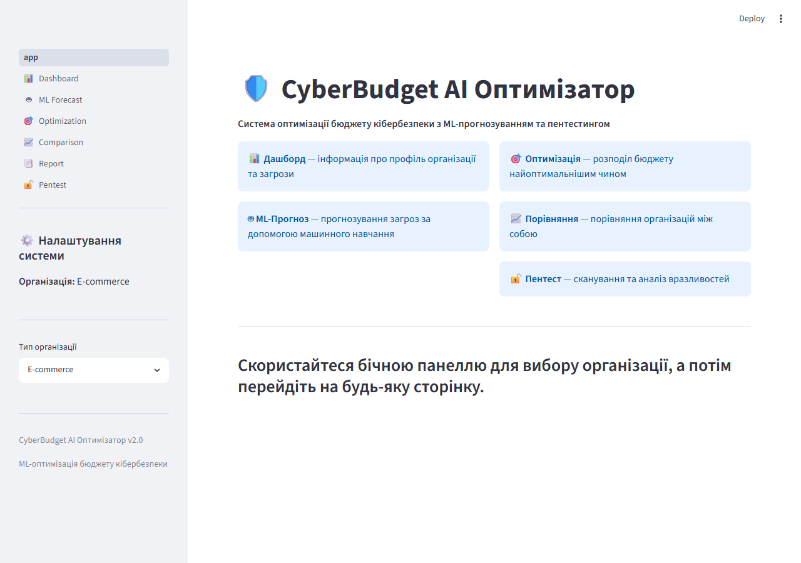
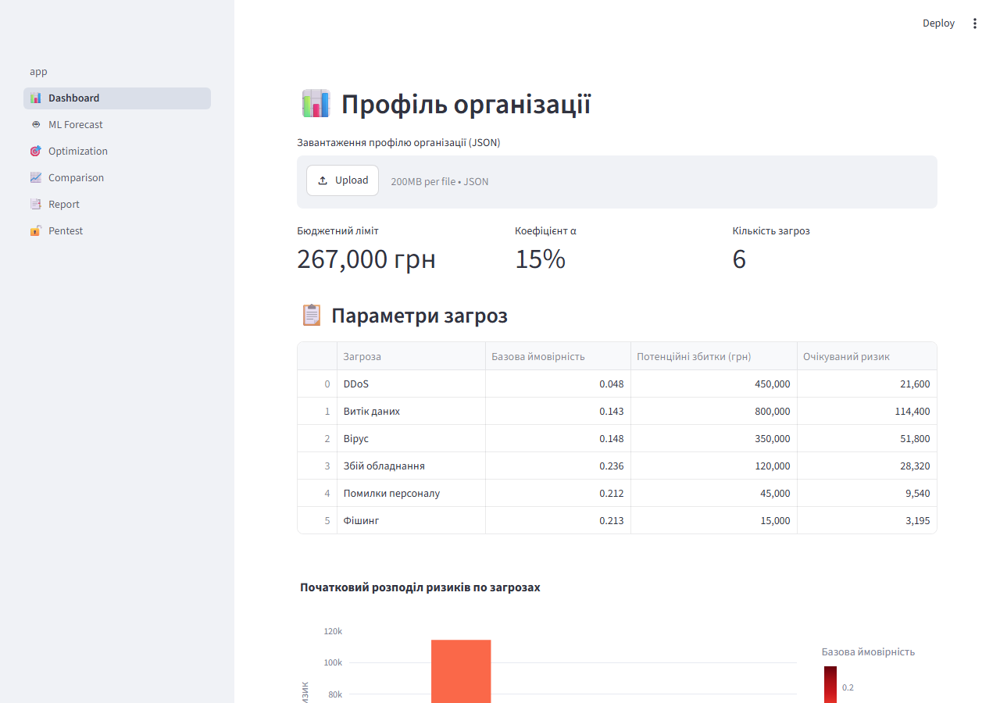
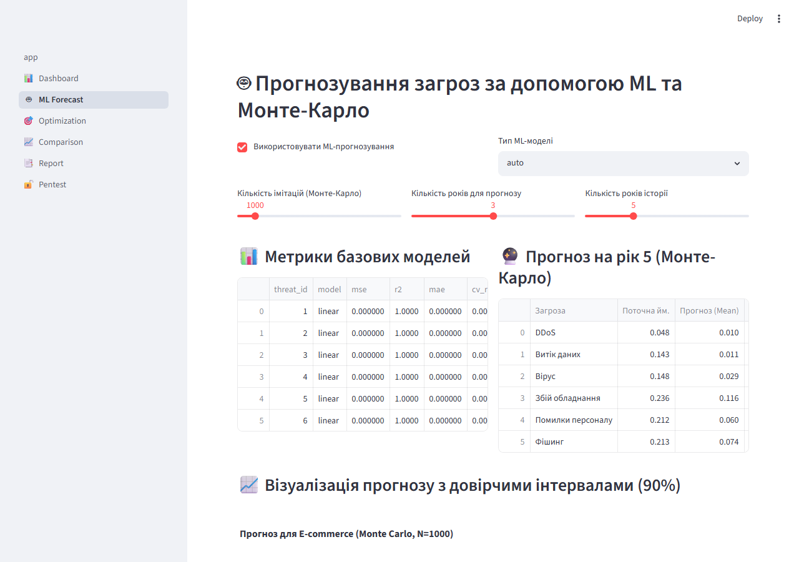
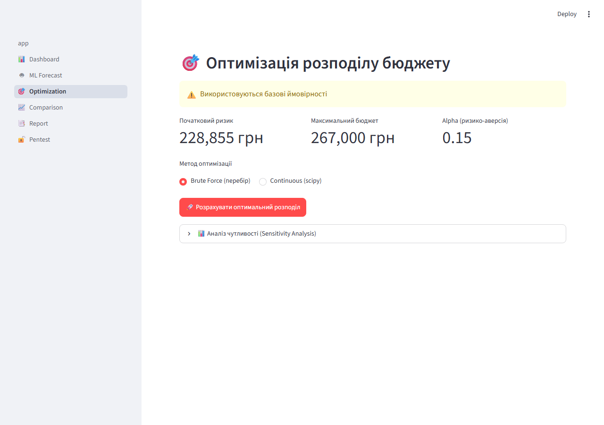
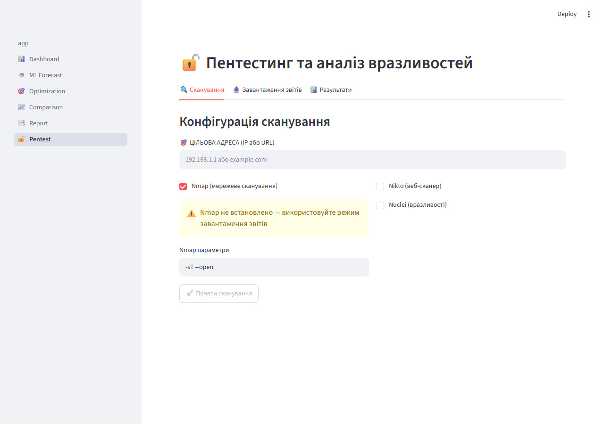

# 🛡️ CyberBudget AI Оптимізатор v2.0

Система оптимізації бюджету кібербезпеки з ML-прогнозуванням та пентестингом для магістерської дисертації.



## 🚀 Можливості

- **📊 Профілі організацій** — E-commerce, Bank, Industry, Healthcare, Telecom, University
- **🤖 ML-прогнозування** — 8 регресійних моделей (Linear, Ridge, Lasso, ElasticNet, RandomForest, GradientBoosting, SVR, DecisionTree)
- **🎲 Монте-Карло** — корельоване та некорельоване моделювання
- **🎯 Оптимізація** — Brute Force (перебір) + Continuous (scipy)
- **📊 Аналіз чутливості** — залежність ризику від бюджету
- **📈 Паретофронт** — багатоцільова оптимізація
- **🔓 Пентестинг** — Nmap + OWASP ZAP + Nikto + Nuclei
- **🗺️ MITRE ATT&CK** — маппінг CWE → ATT&CK техніки
- **🔧 Рекомендації** — пріоритетний план усунення вразливостей

## 📸 Інтерфейс

### Дашборд — профіль організації



### ML-прогнозування загроз



### Оптимізація бюджету



### Пентестинг та аналіз вразливостей



## 🛠️ Встановлення

```bash
# 1. Створення віртуального середовища
python -m venv venv
source venv/bin/activate  # Windows: venv\Scripts\activate

# 2. Встановлення залежностей
pip install -r requirements.txt

# 3. Запуск програми
streamlit run app.py
```

## 📁 Структура проекту

```
roi-optimization/
├── app.py                    # Точка входу (Streamlit)
├── core/                     # Бізнес-логіка
│   ├── config.py             # Централізовані конфігурації
│   ├── data_generator.py     # Профілі організацій
│   ├── ml_forecaster.py      # ML-прогнозування + Монте-Карло
│   ├── optimizer.py          # Оптимізація бюджету
│   ├── pentest_engine.py     # Движок пентестингу
│   └── scanner_integration.py# Парсери ZAP/Nikto/Nuclei/Nmap
├── pages/                    # Сторінки Streamlit
│   ├── 1_📊_Dashboard.py     # Профіль організації
│   ├── 2_🤖_ML_Forecast.py   # ML-прогноз
│   ├── 3_🎯_Optimization.py  # Оптимізація
│   ├── 4_📈_Comparison.py    # Порівняння
│   ├── 5_📑_Report.py        # Звіти
│   └── 6_🔓_Pentest.py       # Пентестинг
├── utils/
│   └── report_generator.py   # Генерація звітів
├── data/
│   └── mitre_mappings.json   # CWE → MITRE ATT&CK
├── tests/                    # Тести
└── requirements.txt
```

## 🔧 Використання

### ML-прогнозування

1. Перейдіть на сторінку **🤖 ML-Прогноз**
2. Оберіть тип ML-моделі (або `auto` для автоматичного вибору)
3. Налаштуйте параметри: кількість імітацій, років для прогнозу, років історії
4. Перегляньте метрики моделей та візуалізацію прогнозу

### Оптимізація бюджету

1. Перейдіть на сторінку **🎯 Оптимізація**
2. Оберіть метод: Brute Force (перебір) або Continuous (scipy)
3. Натисніть "Розрахувати оптимальний розподіл"
4. Перегляньте результати: витрати, зниження ризику, ROI

### Пентестинг

1. Перейдіть на сторінку **🔓 Пентест**
2. Введіть цільову адресу (IP або URL)
3. Оберіть сканери: Nmap, Nikto, Nuclei
4. Або завантажте готові звіти (JSON/XML)
5. Натисніть "Застосувати результати в оптимізаторі"

## 🧪 Тести

```bash
python -m pytest tests/ -v
```

## 📊 Архітектура ML

- **Feature engineering**: лаги, ковзне середнє/ст.відх., поліноміальні ознаки
- **Cross-validation**: KFold (k=3) для оцінки якості моделей
- **Автовибір**: порівняння 8 моделей, вибір найкращої за R²
- **Монте-Карло**: корельоване моделювання через розкладання Холецького

## 🔐 Пентестинг

- **Nmap**: сканування мережі/портів (потребує встановленого nmap)
- **OWASP ZAP**: аналіз веб-додатків
- **Nikto**: перевірка веб-серверів
- **Nuclei**: сканування вразливостей за шаблонами
- **MITRE ATT&CK**: маппінг знахідок на техніки атак

## 📄 Ліцензія

AlexMaster
